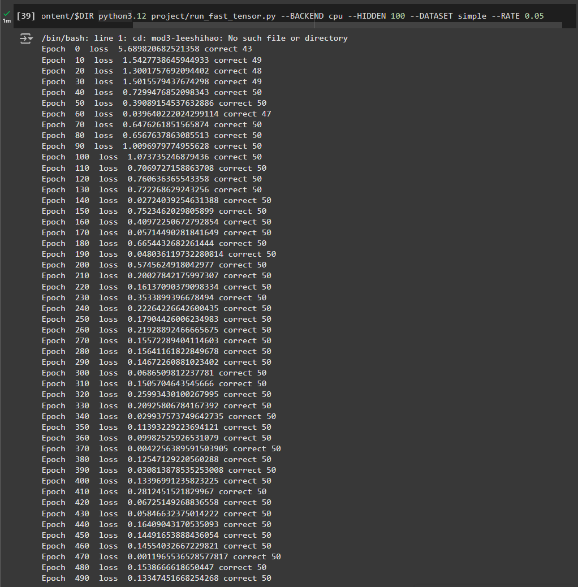
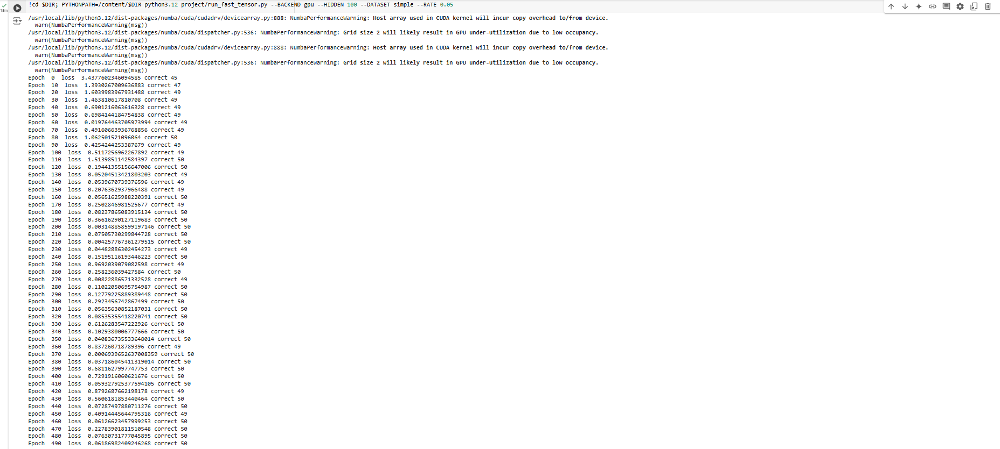
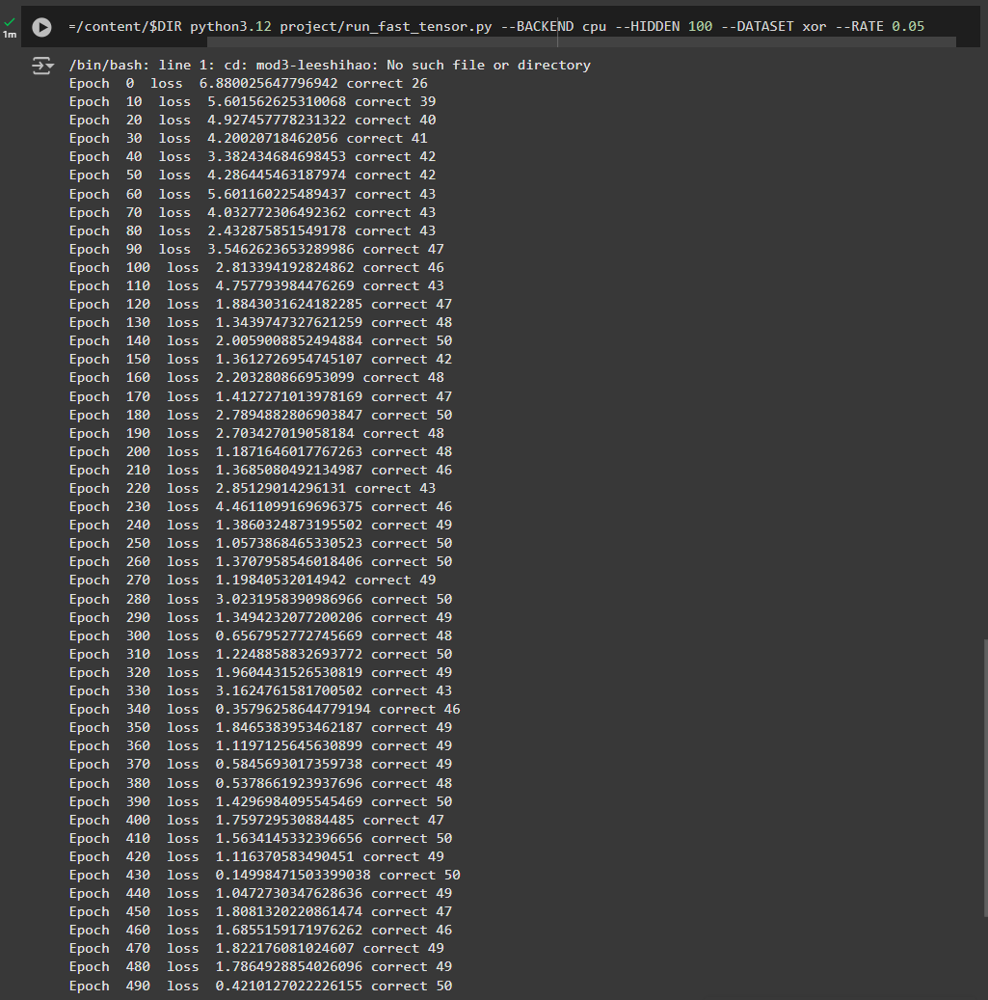
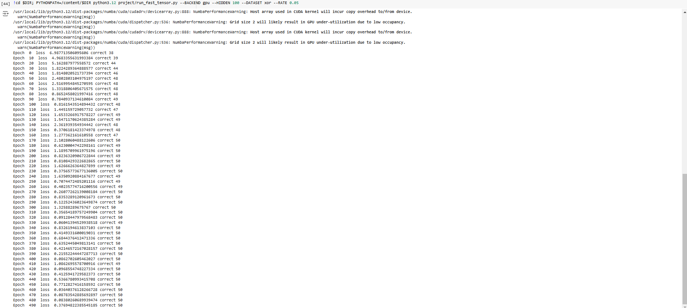
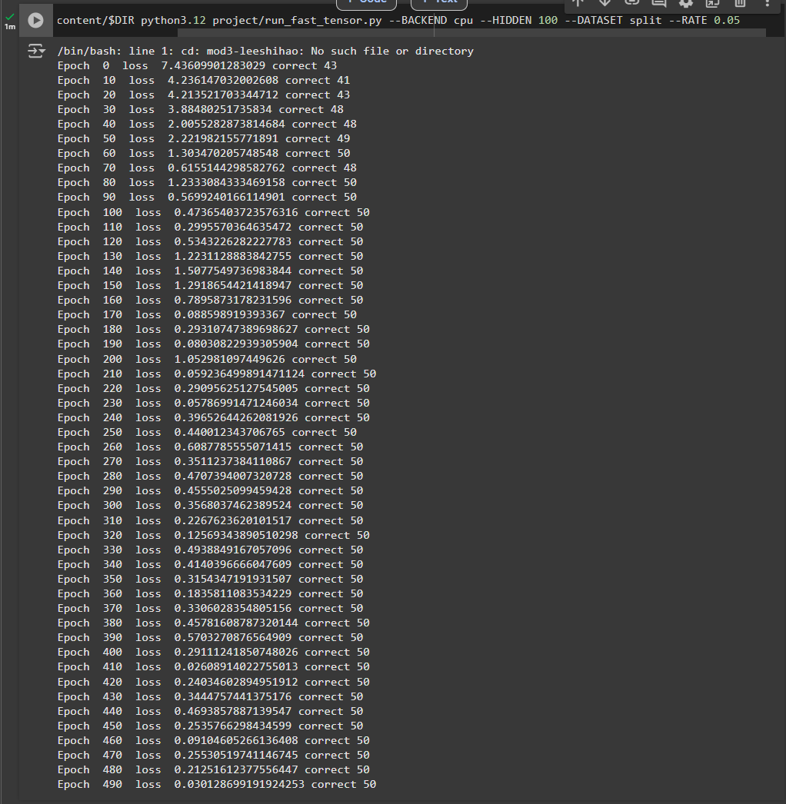
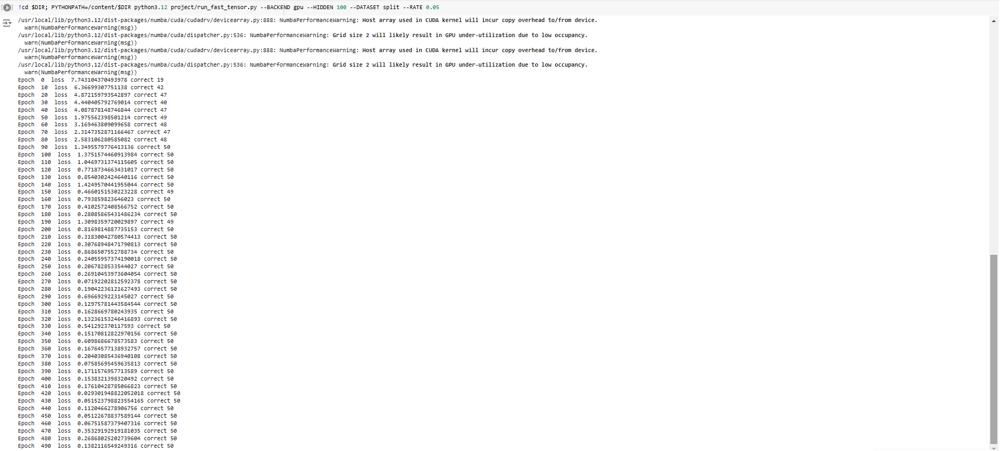

# MiniTorch Module 3


* Docs: https://minitorch.github.io/

* Overview: https://minitorch.github.io/module3.html


You will need to modify `tensor_functions.py` slightly in this assignment.

* Tests:

```
python run_tests.py
```

* Note:

Several of the tests for this assignment will only run if you are on a GPU machine and will not
run on github's test infrastructure. Please follow the instructions to setup up a colab machine
to run these tests.

This assignment requires the following files from the previous assignments. You can get these by running

```bash
python sync_previous_module.py previous-module-dir current-module-dir
```

The files that will be synced are:

        minitorch/tensor_data.py minitorch/tensor_functions.py minitorch/tensor_ops.py minitorch/operators.py minitorch/scalar.py minitorch/scalar_functions.py minitorch/module.py minitorch/autodiff.py minitorch/module.py project/run_manual.py project/run_scalar.py project/run_tensor.py minitorch/operators.py minitorch/module.py minitorch/autodiff.py minitorch/tensor.py minitorch/datasets.py minitorch/testing.py minitorch/optim.py

# Task 3_1 and 3_2 parallel check diagnostics

MAP

================================================================================
 Parallel Accelerator Optimizing:  Function tensor_map.<locals>._map,
C:\Users\Lenovo\Documents\Fall_2024\MLE\mod3-leeshihao\minitorch\fast_ops.py
(166)
================================================================================


Parallel loop listing for  Function tensor_map.<locals>._map, C:\Users\Lenovo\Documents\Fall_2024\MLE\mod3-leeshihao\minitorch\fast_ops.py (166)
------------------------------------------------------------------------------------------------------|loop #ID
    def _map(                                                                                         |
        out: Storage,                                                                                 |
        out_shape: Shape,                                                                             |
        out_strides: Strides,                                                                         |
        in_storage: Storage,                                                                          |
        in_shape: Shape,                                                                              |
        in_strides: Strides,                                                                          |
    ) -> None:                                                                                        |
        # TODO: Implement for Task 3.1.                                                               |
        # Check if out and in are stride-aligned to avoid indexing                                    |
        stride_aligned: bool = False                                                                  |
        if len(out_strides) == len(in_strides) and np.all((out_strides == in_strides)):---------------| #0
            # Check shape is same too                                                                 |
            if np.all(out_shape == in_shape):---------------------------------------------------------| #1
                stride_aligned = True                                                                 |
        if stride_aligned:                                                                            |
            for i in prange(len(out)):----------------------------------------------------------------| #4
                out[i] = fn(in_storage[i])                                                            |
        else:                                                                                         |
            # Convert for loop into parallel                                                          |
            for ordinal in prange(len(out)):----------------------------------------------------------| #5
                # Initialize the out_index and in_index arrays for each thread                        |
                out_index: Index = np.zeros(MAX_DIMS, np.int32)---------------------------------------| #2
                in_index: Index = np.zeros(MAX_DIMS, np.int32)----------------------------------------| #3
                # Convert ordinal (linear position) to the multidimensional `out_index`               |
                to_index(ordinal, out_shape, out_index)                                               |
                # Broadcast `out_index` to `in_index`                                                 |
                broadcast_index(out_index, out_shape, in_shape, in_index)                             |
                # Convert `out_index` and `in_index` to positions in the respective storage arrays    |
                out_pos = index_to_position(out_index, out_strides)                                   |
                in_pos = index_to_position(in_index, in_strides)                                      |
                # Apply the function and store the result in the `out` array                          |
                out[out_pos] = fn(in_storage[in_pos])                                                 |
--------------------------------- Fusing loops ---------------------------------
Attempting fusion of parallel loops (combines loops with similar properties)...

Fused loop summary:
+--2 has the following loops fused into it:
   +--3 (fused)
Following the attempted fusion of parallel for-loops there are 5 parallel for-
loop(s) (originating from loops labelled: #0, #1, #4, #5, #2).
--------------------------------------------------------------------------------
---------------------------- Optimising loop nests -----------------------------
Attempting loop nest rewrites (optimising for the largest parallel loops)...

+--5 is a parallel loop
   +--2 --> rewritten as a serial loop
--------------------------------------------------------------------------------
----------------------------- Before Optimisation ------------------------------
Parallel region 0:
+--5 (parallel)
   +--2 (parallel)
   +--3 (parallel)


--------------------------------------------------------------------------------
------------------------------ After Optimisation ------------------------------
Parallel region 0:
+--5 (parallel)
   +--2 (serial, fused with loop(s): 3)


Parallel region 0 (loop #5) had 1 loop(s) fused and 1 loop(s) serialized as part
 of the larger parallel loop (#5).
--------------------------------------------------------------------------------
--------------------------------------------------------------------------------

---------------------------Loop invariant code motion---------------------------
Allocation hoisting:
The memory allocation derived from the instruction at
C:\Users\Lenovo\Documents\Fall_2024\MLE\mod3-leeshihao\minitorch\fast_ops.py
(188) is hoisted out of the parallel loop labelled #5 (it will be performed
before the loop is executed and reused inside the loop):
   Allocation:: out_index: Index = np.zeros(MAX_DIMS, np.int32)
    - numpy.empty() is used for the allocation.
The memory allocation derived from the instruction at
C:\Users\Lenovo\Documents\Fall_2024\MLE\mod3-leeshihao\minitorch\fast_ops.py
(189) is hoisted out of the parallel loop labelled #5 (it will be performed
before the loop is executed and reused inside the loop):
   Allocation:: in_index: Index = np.zeros(MAX_DIMS, np.int32)
    - numpy.empty() is used for the allocation.
None
ZIP

================================================================================
 Parallel Accelerator Optimizing:  Function tensor_zip.<locals>._zip,
C:\Users\Lenovo\Documents\Fall_2024\MLE\mod3-leeshihao\minitorch\fast_ops.py
(226)
================================================================================


Parallel loop listing for  Function tensor_zip.<locals>._zip, C:\Users\Lenovo\Documents\Fall_2024\MLE\mod3-leeshihao\minitorch\fast_ops.py (226)
-----------------------------------------------------------------------------------------|loop #ID
    def _zip(                                                                            |
        out: Storage,                                                                    |
        out_shape: Shape,                                                                |
        out_strides: Strides,                                                            |
        a_storage: Storage,                                                              |
        a_shape: Shape,                                                                  |
        a_strides: Strides,                                                              |
        b_storage: Storage,                                                              |
        b_shape: Shape,                                                                  |
        b_strides: Strides,                                                              |
    ) -> None:                                                                           |
        # TODO: Implement for Task 3.1.                                                  |
        # Check if out, a, b are stride-aligned to avoid indexing                        |
        if len(out_strides) == len(a_strides) and len(out_strides) == len(b_strides):    |
            if np.all((out_strides == a_strides) & (out_strides == b_strides)):----------| #6
                # Directly apply function to the whole array                             |
                for i in prange(len(out)):-----------------------------------------------| #10
                    out[i] = fn(a_storage[i], b_storage[i])                              |
                                                                                         |
        # Iterate over all positions in the `out` tensor in parallel                     |
        for i in prange(len(out)):-------------------------------------------------------| #11
            # Initialize the out_index and in_index arrays locally                       |
            out_index: Index = np.zeros(MAX_DIMS, np.int32)------------------------------| #7
            a_index: Index = np.zeros(MAX_DIMS, np.int32)--------------------------------| #8
            b_index: Index = np.zeros(MAX_DIMS, np.int32)--------------------------------| #9
            # Convert ordinal (linear position) to the multidimensional `out_index`      |
            to_index(i, out_shape, out_index)                                            |
                                                                                         |
            # Broadcast `out_index` to `a/b_index`                                       |
            broadcast_index(out_index, out_shape, a_shape, a_index)                      |
            broadcast_index(out_index, out_shape, b_shape, b_index)                      |
                                                                                         |
            # Convert indices to positions in the respective storage arrays              |
            out_pos = index_to_position(out_index, out_strides)                          |
            a_pos = index_to_position(a_index, a_strides)                                |
            b_pos = index_to_position(b_index, b_strides)                                |
                                                                                         |
            # Apply the function and store the result in the `out` array                 |
            out[out_pos] = fn(a_storage[a_pos], b_storage[b_pos])                        |
--------------------------------- Fusing loops ---------------------------------
Attempting fusion of parallel loops (combines loops with similar properties)...

Fused loop summary:
+--7 has the following loops fused into it:
   +--8 (fused)
   +--9 (fused)
Following the attempted fusion of parallel for-loops there are 4 parallel for-
loop(s) (originating from loops labelled: #6, #10, #11, #7).
--------------------------------------------------------------------------------
---------------------------- Optimising loop nests -----------------------------
Attempting loop nest rewrites (optimising for the largest parallel loops)...

+--11 is a parallel loop
   +--7 --> rewritten as a serial loop
--------------------------------------------------------------------------------
----------------------------- Before Optimisation ------------------------------
Parallel region 0:
+--11 (parallel)
   +--7 (parallel)
   +--8 (parallel)
   +--9 (parallel)


--------------------------------------------------------------------------------
------------------------------ After Optimisation ------------------------------
Parallel region 0:
+--11 (parallel)
   +--7 (serial, fused with loop(s): 8, 9)


Parallel region 0 (loop #11) had 2 loop(s) fused and 1 loop(s) serialized as
part of the larger parallel loop (#11).
--------------------------------------------------------------------------------
--------------------------------------------------------------------------------

---------------------------Loop invariant code motion---------------------------
Allocation hoisting:
The memory allocation derived from the instruction at
C:\Users\Lenovo\Documents\Fall_2024\MLE\mod3-leeshihao\minitorch\fast_ops.py
(248) is hoisted out of the parallel loop labelled #11 (it will be performed
before the loop is executed and reused inside the loop):
   Allocation:: out_index: Index = np.zeros(MAX_DIMS, np.int32)
    - numpy.empty() is used for the allocation.
The memory allocation derived from the instruction at
C:\Users\Lenovo\Documents\Fall_2024\MLE\mod3-leeshihao\minitorch\fast_ops.py
(249) is hoisted out of the parallel loop labelled #11 (it will be performed
before the loop is executed and reused inside the loop):
   Allocation:: a_index: Index = np.zeros(MAX_DIMS, np.int32)
    - numpy.empty() is used for the allocation.
The memory allocation derived from the instruction at
C:\Users\Lenovo\Documents\Fall_2024\MLE\mod3-leeshihao\minitorch\fast_ops.py
(250) is hoisted out of the parallel loop labelled #11 (it will be performed
before the loop is executed and reused inside the loop):
   Allocation:: b_index: Index = np.zeros(MAX_DIMS, np.int32)
    - numpy.empty() is used for the allocation.
None
REDUCE

================================================================================
 Parallel Accelerator Optimizing:  Function tensor_reduce.<locals>._reduce,
C:\Users\Lenovo\Documents\Fall_2024\MLE\mod3-leeshihao\minitorch\fast_ops.py
(290)
================================================================================


Parallel loop listing for  Function tensor_reduce.<locals>._reduce, C:\Users\Lenovo\Documents\Fall_2024\MLE\mod3-leeshihao\minitorch\fast_ops.py (290)
---------------------------------------------------------------------------------------|loop #ID
    def _reduce(                                                                       |
        out: Storage,                                                                  |
        out_shape: Shape,                                                              |
        out_strides: Strides,                                                          |
        a_storage: Storage,                                                            |
        a_shape: Shape,                                                                |
        a_strides: Strides,                                                            |
        reduce_dim: int,                                                               |
    ) -> None:                                                                         |
        # TODO: Implement for Task 3.1.                                                |
        reduce_size = a_shape[reduce_dim]                                              |
                                                                                       |
        # Iterate over all positions in the `out` tensor in parallel                   |
        for ordinal in prange(len(out)):-----------------------------------------------| #13
            # Initialize the out_index locally in thread                               |
            out_index: Index = np.zeros(MAX_DIMS, np.int32)----------------------------| #12
            # Convert ordinal (linear position) to the multidimensional `out_index`    |
            to_index(ordinal, out_shape, out_index)                                    |
            out_pos = index_to_position(out_index, out_strides)                        |
            # Initialize the output value as a local variable for reduction            |
            temp_output = out[out_pos]                                                 |
            # Calculate initial index for when out_index[reduce_dim] = 0               |
            out_index[reduce_dim] = 0                                                  |
            j = index_to_position(out_index, a_strides)                                |
            reduce_dim_stride = a_strides[reduce_dim]                                  |
            # Iterate over the `reduce_dim` and apply the reduction function `fn`      |
            for _ in range(reduce_size):                                               |
                # replace function call with direct calculation                        |
                temp_output = fn(                                                      |
                    temp_output, a_storage[j]                                          |
                )  # Start with j first since we calculated it already                 |
                j += reduce_dim_stride  # Increment j by stride of reduce_dim          |
                                                                                       |
            # Store the reduced value in the `out` array                               |
            out[out_pos] = temp_output                                                 |
--------------------------------- Fusing loops ---------------------------------
Attempting fusion of parallel loops (combines loops with similar properties)...
Following the attempted fusion of parallel for-loops there are 2 parallel for-
loop(s) (originating from loops labelled: #13, #12).
--------------------------------------------------------------------------------
---------------------------- Optimising loop nests -----------------------------
Attempting loop nest rewrites (optimising for the largest parallel loops)...

+--13 is a parallel loop
   +--12 --> rewritten as a serial loop
--------------------------------------------------------------------------------
----------------------------- Before Optimisation ------------------------------
Parallel region 0:
+--13 (parallel)
   +--12 (parallel)


--------------------------------------------------------------------------------
------------------------------ After Optimisation ------------------------------
Parallel region 0:
+--13 (parallel)
   +--12 (serial)


Parallel region 0 (loop #13) had 0 loop(s) fused and 1 loop(s) serialized as
part of the larger parallel loop (#13).
--------------------------------------------------------------------------------
--------------------------------------------------------------------------------

---------------------------Loop invariant code motion---------------------------
Allocation hoisting:
The memory allocation derived from the instruction at
C:\Users\Lenovo\Documents\Fall_2024\MLE\mod3-leeshihao\minitorch\fast_ops.py
(305) is hoisted out of the parallel loop labelled #13 (it will be performed
before the loop is executed and reused inside the loop):
   Allocation:: out_index: Index = np.zeros(MAX_DIMS, np.int32)
    - numpy.empty() is used for the allocation.
None
MATRIX MULTIPLY

================================================================================
 Parallel Accelerator Optimizing:  Function _tensor_matrix_multiply,
C:\Users\Lenovo\Documents\Fall_2024\MLE\mod3-leeshihao\minitorch\fast_ops.py
(329)
================================================================================


Parallel loop listing for  Function _tensor_matrix_multiply, C:\Users\Lenovo\Documents\Fall_2024\MLE\mod3-leeshihao\minitorch\fast_ops.py (329)
--------------------------------------------------------------------------------------------|loop #ID
def _tensor_matrix_multiply(                                                                |
    out: Storage,                                                                           |
    out_shape: Shape,                                                                       |
    out_strides: Strides,                                                                   |
    a_storage: Storage,                                                                     |
    a_shape: Shape,                                                                         |
    a_strides: Strides,                                                                     |
    b_storage: Storage,                                                                     |
    b_shape: Shape,                                                                         |
    b_strides: Strides,                                                                     |
) -> None:                                                                                  |
    """NUMBA tensor matrix multiply function.                                               |
                                                                                            |
    Should work for any tensor shapes that broadcast as long as                             |
                                                                                            |
    ```                                                                                     |
    assert a_shape[-1] == b_shape[-2]                                                       |
    ```                                                                                     |
                                                                                            |
    Optimizations:                                                                          |
                                                                                            |
    * Outer loop in parallel                                                                |
    * No index buffers or function calls                                                    |
    * Inner loop should have no global writes, 1 multiply.                                  |
                                                                                            |
                                                                                            |
    Args:                                                                                   |
    ----                                                                                    |
        out (Storage): storage for `out` tensor                                             |
        out_shape (Shape): shape for `out` tensor                                           |
        out_strides (Strides): strides for `out` tensor                                     |
        a_storage (Storage): storage for `a` tensor                                         |
        a_shape (Shape): shape for `a` tensor                                               |
        a_strides (Strides): strides for `a` tensor                                         |
        b_storage (Storage): storage for `b` tensor                                         |
        b_shape (Shape): shape for `b` tensor                                               |
        b_strides (Strides): strides for `b` tensor                                         |
                                                                                            |
    Returns:                                                                                |
    -------                                                                                 |
        None : Fills in `out`                                                               |
                                                                                            |
    """                                                                                     |
    a_batch_stride = a_strides[0] if a_shape[0] > 1 else 0                                  |
    b_batch_stride = b_strides[0] if b_shape[0] > 1 else 0                                  |
                                                                                            |
    # TODO: Implement for Task 3.2.                                                         |
    # Initialize local variables to avoid global reads                                      |
    # a = (batch, i, k), b = (batch, k, j), Out = (batch, i, j),                            |
    out_batch_stride = out_strides[0] if out_shape[0] > 1 else 0                            |
    out_i_stride = out_strides[-2]                                                          |
    out_j_stride = out_strides[-1]                                                          |
    a_i_stride = a_strides[-2]                                                              |
    a_k_stride = a_strides[-1]                                                              |
    b_j_stride = b_strides[-1]                                                              |
    b_k_stride = b_strides[-2]                                                              |
    # Perform the matrix multiplication                                                     |
    for batch in prange(out_shape[0]):------------------------------------------------------| #16
        for i in prange(out_shape[-2]):-----------------------------------------------------| #15
            for j in prange(out_shape[-1]):-------------------------------------------------| #14
                # Calculate linear index for out                                            |
                out_pos = batch * out_batch_stride + i * out_i_stride + j * out_j_stride    |
                # Calculate linear index for a (start with k = 0)                           |
                a_pos = batch * a_batch_stride + i * a_i_stride                             |
                # Calculate linear index for b                                              |
                b_pos = batch * b_batch_stride + j * b_j_stride                             |
                # Calculate the value for out                                               |
                temp = 0                                                                    |
                for k in range(a_shape[-1]):                                                |
                    temp += a_storage[a_pos] * b_storage[b_pos]  # avoid global write       |
                    a_pos += a_k_stride  # add for each k                                   |
                    b_pos += b_k_stride  # add for each k                                   |
                out[out_pos] = temp                                                         |
--------------------------------- Fusing loops ---------------------------------
Attempting fusion of parallel loops (combines loops with similar properties)...
Following the attempted fusion of parallel for-loops there are 2 parallel for-
loop(s) (originating from loops labelled: #16, #15).
--------------------------------------------------------------------------------
---------------------------- Optimising loop nests -----------------------------
Attempting loop nest rewrites (optimising for the largest parallel loops)...

+--16 is a parallel loop
   +--15 --> rewritten as a serial loop
      +--14 --> rewritten as a serial loop
--------------------------------------------------------------------------------
----------------------------- Before Optimisation ------------------------------
Parallel region 0:
+--16 (parallel)
   +--15 (parallel)
      +--14 (parallel)


--------------------------------------------------------------------------------
------------------------------ After Optimisation ------------------------------
Parallel region 0:
+--16 (parallel)
   +--15 (serial)
      +--14 (serial)


Parallel region 0 (loop #16) had 0 loop(s) fused and 2 loop(s) serialized as
part of the larger parallel loop (#16).
--------------------------------------------------------------------------------
--------------------------------------------------------------------------------

---------------------------Loop invariant code motion---------------------------
Allocation hoisting:
No allocation hoisting found
None

# Task 3_5
## Simple dataset - CPU

## Simple dataset - GPU

## Xor dataset - CPU

## Xor dataset - GPU

## Split dataset - CPU

## Split dataset - GPU
